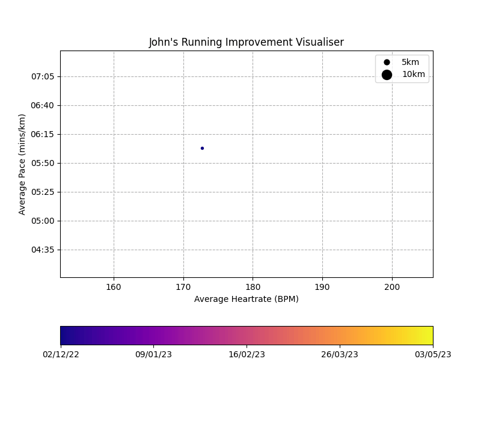

This repo contains a small script that generates an animated graph using your Strava data. Is the code quality good? Not particularly, because I don't really intend on anyone else even using it. If people do, or if I want to make more visualisations though, then I'll clean it up.

# Example

# Setup

1. Firstly, you'll have to go to Strava's devs page and make an application. You can find instructions for how to do this on the internet. Follow these and get your apps "client_id" and "client_key".

2. Create a file in this repo called: "keys.py". It should contain the "client_id" and "client_secret". Feel free to rename my file: "keys_example.py", and paste in your keys to ensure the formatting is correct.

3. Using python, make sure all the required packages are installed with `pip install -r requirements.txt`.

4. Run with: `python strava_visualiser.py`

5. You'll be redirected to Strava to log in. Once permission is given, you'll be redirected to a URL that points to localhost. This is intentional. In the URL will look like this: "http://localhost:8000/?state=&code=[YOUR CODE HERE]&scope=read,activity:read_all,profile:read_all". Copy out your code and paste it back into the terminal.

6. Enjoy your nice animation.
